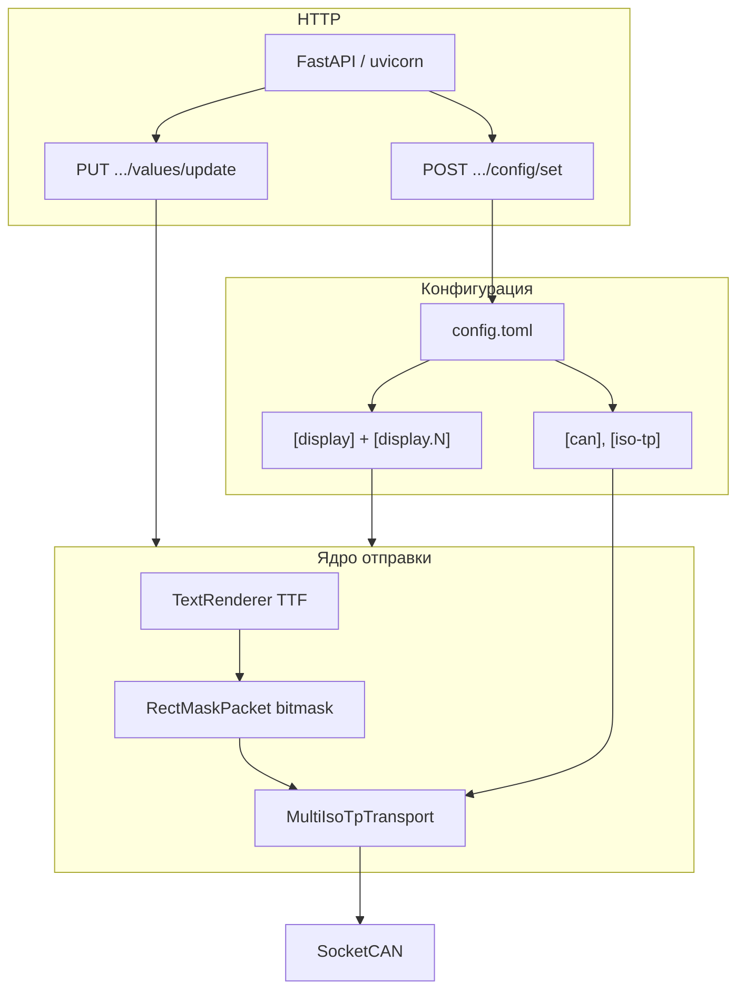

# CAN Tablo Driver

Сервис управления LED-табло по **CAN** с транспортом **ISO-TP** (29-bit идентификаторы). Один процесс на узле соответствует **одному контроллеру и одному физическому табло**: разметка экрана задаётся **зонами**, строки для зон приходят по **REST API**, конфигурация хранится в **TOML**.

Подробный контракт HTTP для интеграторов: [docs/API_LEDDISPLAYS_V2.md](docs/API_LEDDISPLAYS_V2.md). Документы V1 сохранены для совместимости: [docs/API_LEDDISPLAYS_V1.md](docs/API_LEDDISPLAYS_V1.md), [docs/API_LEDDISPLAYS_V1_EXTERNAL.md](docs/API_LEDDISPLAYS_V1_EXTERNAL.md).

---

## Концепция

| Идея | Описание |
|------|----------|
| **Один контроллер — одно табло** | Не описываем несколько независимых табло в одном конфиге маршрутного типа; одна пара `sender_tx_id` / `sender_rx_id`, один холст `width`×`height`. |
| **Зоны** | Каждая зона имеет `area` (x, y, w, h), отступы `padding`, индексы цветов `fg`/`bg` в палитре `color-map`, индекс шрифта. Какие зоны активны, задаёт конфиг (`[display.1]`, `[display.2]`, …). |
| **Цвет на шине** | В посылке на табло передаётся **один байт** кода не-чёрного цвета (как в протоколе области); палитра в API — RGB по индексам 0–15, на физическом уровне в первую очередь используются согласованные оттенки (чёрный / жёлтый). |
| **Статика и бегущая строка** | Для каждой области выбирается операция **0x0001** (текст помещается в окно) или **0x0002** (растр полной ширины текста для прокрутки на стороне табло). |
| **Асинхронная отправка по CAN** | После успешного HTTP-ответа «принято» передача на шину выполняется в фоне, чтобы не блокировать event loop. |

---

## Архитектура



1. **`config.toml`** — канал шины, ISO-TP, логи, пути к JSON/шрифту, секция **`[display]`** (идентификатор табло, CAN ID, размер холста, вложенная **`color_map`**) и таблицы **`[display.N]`** с разметкой зон.
2. **REST** — частичное обновление настроек (`color-map`, `zones`) с **слиянием** в файл и в память; выдача текстов по зонам и постановка задачи отправки.
3. **Рендеринг** — текст зоны → монохромное изображение (PIL) → битовая маска → заголовок 11 байт (op, x, y, w, h, color) + маска → **ISO-TP** на выбранную пару ID.
4. **Приём / отладка** — режим `recv` (эмулятор контроллера) раскладывает payload обратно в PNG в каталог логов.

Зависимости (ориентир): `python-can`, `can-isotp`, `Pillow`, `FastAPI`, `uvicorn`, `tomli` / `tomli-w`.

---

## Справочник эндпоинтов (контракт V2)

Базовый URL: `http://<хост>:<порт>` (хост и порт из секции `[api-server]` в `config.toml`).

Общие правила:

- Запросы с телом: `Content-Type: application/json`.
- Ответы: JSON, UTF-8.
- Ключи в JSON: **kebab-case** (`color-map`, `timestamp-utc`, …).
- Префикс API: `/api/leddisplays/v1/` (кроме ping).

### `GET /api/ping`

Проверка доступности.

| Код | Тело | Описание |
|-----|------|----------|
| 200 | `running`, `timestamp-utc`, `display-id` | Сервис жив; `display-id` — строковый идентификатор табло из конфига. |

Пример ответа:

```json
{
  "running": "OK",
  "timestamp-utc": "2026-03-29T12:34:56.789+00:00",
  "display-id": "front-display"
}
```

### `POST /api/leddisplays/v1/config/set`

Частичное обновление конфигурации. Отсутствующие поля **не сбрасывают** уже сохранённые значения.

| Поле тела | Тип | Описание |
|-----------|-----|----------|
| `color-map` | object | Ключи `"0"`…`"15"`, значения: `{ "r", "g", "b" }` (0–255). |
| `zones` | object | Ключи id зон (`"1"`…`"10"` и т.д.): `bg`, `fg`, `font`, `area` (x, y, w, h), `padding` (t, r, b, l). |

| Код | Пример тела | Когда |
|-----|-------------|--------|
| 200 | `{"status":"ok"}` | Изменения записаны и применены. |
| 200 | `{"status":"noop"}` | Нечего применять (пустое тело обновлений). |
| 400 | `{"detail":"..."}` | Недопустимые значения. |
| 422 | ошибки валидации FastAPI | Неверная структура или типы. |

### `PUT /api/leddisplays/v1/values/update`

Задать текст для зон и инициировать **асинхронную** отправку на табло, настроенное в `config.toml`.

| Поле тела | Тип | Описание |
|-----------|-----|----------|
| `values` | object | Соответствие индекс зоны (строковый ключ в JSON) → строка для отображения. |

| Код | Пример ответа | Когда |
|-----|----------------|--------|
| 200 | `{"status":"accepted"}` | Значения приняты, отправка поставлена в очередь. |
| 422 | ошибки валидации | Неверное тело. |

Пример запроса:

```json
{
  "values": {
    "1": "567А",
    "2": "Начальная остановка",
    "3": "Конечная остановка",
    "8": "Текст бегущей строки"
  }
}
```

### Семантика id зон (рекомендация)

| ID зоны | Назначение |
|:-------:|------------|
| 1 | Номер маршрута |
| 2 | Начальная остановка |
| 3 | Конечная остановка |
| 4 | Следующие остановки (при необходимости) |
| 8, 9 | Бегущая строка в салоне |

Фактический набор отображаемых полей определяется **тем, какие зоны описаны в конфиге**.

---

## Примеры запуска (CLI)

Рабочий каталог — каталог с `config.toml` или укажите путь через `-c` / `--config`.

```bash
# Отправить содержимое text-in.json на табло по текущему конфигу (CAN)
python src/main.py send -c src/config.toml

# HTTP API (хост/порт из секции [api-server] в config.toml: host, port)
python src/main.py api -c src/config.toml

# То же через стартовый скрипт в корне репозитория (по умолчанию ./config.toml)
uv run python run_api_server.py
uv run python run_api_server.py --config path/to/config.toml

# Локальная проверка без CAN: рендер → payload → восстановление картинки
python src/main.py demo -c src/config.toml

# Приём ISO-TP и сохранение областей в PNG (отладка)
python src/main.py recv -c src/config.toml
```

Запуск API через uvicorn напрямую (аналогично тому, что делает режим `api`):

```bash
cd src
uvicorn api_app:app --host 0.0.0.0 --port 8000
```


---

## Docker (Compose)

Образ: минимальный `debian:bookworm-slim`, зависимости через `uv sync --frozen`, рабочий каталог `/opt/can-tablo`, часовой пояс **UTC**, процесс под пользователем UID 1000.

**Подготовка**

1. Скопируйте пример конфигурации: `cp docker/etc/config.example.toml docker/etc/config.toml` и при необходимости отредактируйте CAN ID и зоны.
2. В `docker/data/` положите `text-in.json`, шрифт (например `DejaVuSans.ttf`) и при необходимости создайте каталог `logs` — пути в `config.toml` должны совпадать с `/opt/can-tablo/data/...` (см. пример).

**Сборка и запуск**

```bash
docker compose up --build
```

В [compose.yaml](compose.yaml) по умолчанию включён `network_mode: host` (SocketCAN на Linux). Дополнительные группы (`dialout`) и проброс `/dev/...` настройте под вашу систему (комментарии в файле).

**Точка входа в образе**

```text
uv run --no-sync run_api_server --config /opt/can-tablo/etc/config.toml
```

Конфиг монтируется с хоста: `./docker/etc` → `/opt/can-tablo/etc` (только чтение), данные: `./docker/data` → `/opt/can-tablo/data`.


---

## Примеры HTTP (curl)

Замените `HOST` и `PORT` на значения из конфига.

**Ping**

```bash
curl -sS "http://HOST:PORT/api/ping"
```

Ожидаемо: HTTP 200 и JSON с `running`, `timestamp-utc`, при реализации V2 — `display-id`.

**Частичная настройка палитры и зоны**

```bash
curl -sS -X POST "http://HOST:PORT/api/leddisplays/v1/config/set" \
  -H "Content-Type: application/json" \
  -d '{
    "color-map": {
      "0": {"r": 0, "g": 0, "b": 0},
      "2": {"r": 255, "g": 255, "b": 0}
    },
    "zones": {
      "1": {
        "bg": 0,
        "fg": 2,
        "font": 1,
        "area": {"x": 0, "y": 0, "w": 96, "h": 64},
        "padding": {"t": 2, "r": 2, "b": 2, "l": 2}
      }
    }
  }'
```

Ожидаемо: `{"status":"ok"}` или `{"status":"noop"}`.

**Обновление строк и отправка на табло**

```bash
curl -sS -X PUT "http://HOST:PORT/api/leddisplays/v1/values/update" \
  -H "Content-Type: application/json" \
  -d '{"values":{"1":"567А","2":"Улица Ленина"}}'
```

Ожидаемо: `{"status":"accepted"}`; в логах сервиса — попытка передачи по CAN (ошибки шины не отражаются в теле этого ответа).

---

## Формат посылки области (кратко)

Используется единый бинарный формат для каждой отображаемой области:

| Смещение | Размер | Содержимое |
|----------|--------|------------|
| 0 | 2 | `op` uint16 LE: `0x0001` или `0x0002` |
| 2 | 2 | `x` |
| 4 | 2 | `y` |
| 6 | 2 | `width` |
| 8 | 2 | `height` |
| 10 | 1 | код цвета для ненулевых битов маски |
| 11 | N | битовая маска, строка за строкой (MSB-first в байте) |

Подробнее см. модуль [src/main.py](src/main.py) (комментарий в начале файла).

---

## Конфигурация

- Скопируйте [src/config.toml.example](src/config.toml.example) в `config.toml` и задайте реальные CAN ID, размеры и зоны.
- Структура табло: секция **`[display]`** с обязательным **`display-id`**, `sender_tx_id`, `sender_rx_id`, `width`, `height`, вложенная **`color_map`** и таблицы **`[display.1]`**, **`[display.2]`**, … (см. [src/config.toml.example](src/config.toml.example) и [docs/API_LEDDISPLAYS_V2.md](docs/API_LEDDISPLAYS_V2.md)).

---

## Тесты и симуляция

```bash
pytest tests/
```

Скрипт симуляции (если доступен в дереве исходников): отправка без реальной шины с сохранением итоговых изображений — см. [src/simulate_all_displays.py](src/simulate_all_displays.py).

---

## Устаревшая документация API

Файлы [docs/API_LEDDISPLAYS_V1.md](docs/API_LEDDISPLAYS_V1.md) и [docs/API_LEDDISPLAYS_V1_EXTERNAL.md](docs/API_LEDDISPLAYS_V1_EXTERNAL.md) помечены как устаревшие; актуальный справочник — **[docs/API_LEDDISPLAYS_V2.md](docs/API_LEDDISPLAYS_V2.md)**.
